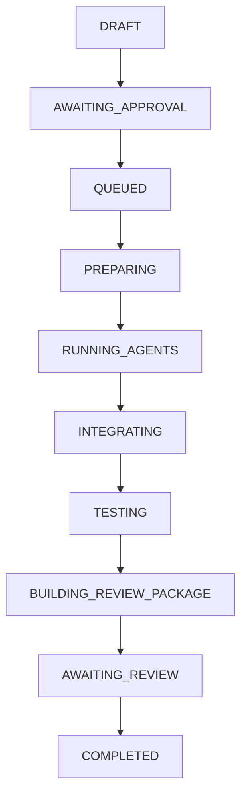

# Job State Machine Specification

## 1. Overview
The Job State Machine in `@local-orchestrator/orchestrator` governs the execution lifecycle of orchestrator jobs. It ensures strict, deterministic state transitions, prevents illegal status mutations, and maintains an accurate audit history for all orchestration tasks.

## 2. Role in Local Orchestrator
In the Local Orchestrator architecture, the Job State Machine acts as the core state manager for multi-agent workflows. It enforces:
- Proper sequence of steps from initial draft to final completion or termination.
- Strict control over retry loops (fix rounds).
- Safe pause and cancel capabilities.
- Auditability via structured events.

## 3. Job States
The state machine defines 14 states (`JobStatus`):

| State | Category | Description |
|---|---|---|
| `DRAFT` | Initial | Job created from plan, awaiting submission |
| `AWAITING_APPROVAL` | Active | Plan awaiting user or system approval |
| `QUEUED` | Active | Job approved and queued for worker execution |
| `PREPARING` | Active | Initializing workspace, resources, or environment |
| `RUNNING_AGENTS` | Active | Subagents actively executing subtasks |
| `INTEGRATING` | Active | Merging subagent outputs and code changes |
| `TESTING` | Active | Running verification and test suites |
| `BUILDING_REVIEW_PACKAGE` | Active | Packaging changesets and diffs for user review |
| `AWAITING_REVIEW` | Active | Review package ready, waiting for user feedback |
| `FIXING` | Active | Executing corrective actions after review feedback |
| `PAUSED` | Non-Terminal | Execution suspended; can resume or fail/cancel |
| `COMPLETED` | Terminal | Work successfully completed and accepted |
| `FAILED` | Terminal | Execution failed due to unrecoverable error |
| `CANCELLED` | Terminal | Execution explicitly cancelled by user or system |

### Terminal States
Terminal states represent end-of-lifecycle states. Once a job reaches a terminal state, **no further state transitions are permitted**.
- `COMPLETED`
- `FAILED`
- `CANCELLED`

### PAUSED vs Terminal States
Unlike terminal states (`COMPLETED`, `FAILED`, `CANCELLED`), `PAUSED` is a **non-terminal state**. A job in `PAUSED` state can be resumed back to `QUEUED`, `RUNNING_AGENTS`, or `AWAITING_REVIEW`, or moved to `FAILED` / `CANCELLED`.

## 4. State Transition Rules Table
The transition rules are defined in `packages/orchestrator/src/job-types.ts` and strictly enforced by pure functions `canTransitionJob()` and `getAllowedTransitions()`.

| From State | Allowed Target States |
|---|---|
| `DRAFT` | `AWAITING_APPROVAL` |
| `AWAITING_APPROVAL` | `QUEUED`, `CANCELLED` |
| `QUEUED` | `PREPARING`, `CANCELLED` |
| `PREPARING` | `RUNNING_AGENTS`, `FAILED`, `CANCELLED`, `PAUSED` |
| `RUNNING_AGENTS` | `INTEGRATING`, `FAILED`, `CANCELLED`, `PAUSED` |
| `INTEGRATING` | `TESTING`, `FAILED`, `PAUSED`, `CANCELLED` |
| `TESTING` | `BUILDING_REVIEW_PACKAGE`, `FAILED`, `PAUSED`, `CANCELLED` |
| `BUILDING_REVIEW_PACKAGE` | `AWAITING_REVIEW`, `FAILED`, `PAUSED` |
| `AWAITING_REVIEW` | `COMPLETED`, `FIXING`, `PAUSED`, `FAILED`, `CANCELLED` |
| `FIXING` | `RUNNING_AGENTS`, `FAILED`, `PAUSED`, `CANCELLED` |
| `PAUSED` | `QUEUED`, `RUNNING_AGENTS`, `AWAITING_REVIEW`, `FAILED`, `CANCELLED` |
| `COMPLETED` | *(None - Terminal)* |
| `FAILED` | *(None - Terminal)* |
| `CANCELLED` | *(None - Terminal)* |

### Invalid Transitions
Any transition not present in the table above is rejected with error code `INVALID_TRANSITION`. Examples of invalid transitions:
- `DRAFT` → `COMPLETED` (Skipping intermediate phases)
- `QUEUED` → `QUEUED` (Self-transition)
- `COMPLETED` → `RUNNING_AGENTS` (Transitioning out of a terminal state)
- `CANCELLED` → `QUEUED` (Resuming a cancelled job)

## 5. Primary Workflows

### Happy Path Workflow


### Fix Round Workflow
When user review requests changes from `AWAITING_REVIEW`:
1. `fixRound` is incremented via `store.incrementFixRound(jobId, reason)` (must be ≤ `maxFixRounds`).
2. Job transitions `AWAITING_REVIEW` → `FIXING`.
3. Job re-enters pipeline: `FIXING` → `RUNNING_AGENTS` → `INTEGRATING` → `TESTING` → `BUILDING_REVIEW_PACKAGE` → `AWAITING_REVIEW`.
4. If `fixRound` exceeds `maxFixRounds` (default max is 2), `incrementFixRound` throws `FIX_ROUND_LIMIT_EXCEEDED`.

### Cancellation Workflow
Jobs can be cancelled from any non-terminal state except `DRAFT` and `BUILDING_REVIEW_PACKAGE`:
- `AWAITING_APPROVAL`, `QUEUED`, `PREPARING`, `RUNNING_AGENTS`, `INTEGRATING`, `TESTING`, `AWAITING_REVIEW`, `FIXING`, `PAUSED` → `CANCELLED`.

## 6. Fix Round Limits (`fixRound` & `maxFixRounds`)
- `maxFixRounds`: Configured when creating a job (must be an integer 0..2; defaults to 2).
- `fixRound`: Incremented when `incrementFixRound()` is called while state is `AWAITING_REVIEW` or `FIXING`.
- Attempts to increment beyond `maxFixRounds` throw `FIX_ROUND_LIMIT_EXCEEDED` and preserve current state and fixRound without modification.

## 7. Audit Event Sequence
- Every state change or fix round increment appends an immutable event to `events.jsonl`.
- Sequence numbers start at `1` (`JOB_CREATED` event) and strictly increment by 1 for each subsequent event.
- Sequence continuity is validated on read by `listEvents()`.

## 8. Usage Example (Public API)
```typescript
import { JobStore, JobStatus, canTransitionJob } from "@local-orchestrator/orchestrator";

// Check valid transition
console.log(canTransitionJob(JobStatus.DRAFT, JobStatus.AWAITING_APPROVAL)); // true

const store = new JobStore("/tmp/jobs");

// Create job
const job = await store.createJob({
  jobId: "JOB-101",
  planId: "PLAN-101",
  projectId: "PROJ-101",
  maxFixRounds: 2
});

// Perform transition
await store.transitionJob("JOB-101", JobStatus.AWAITING_APPROVAL, "Plan submitted");
```

## 9. Current Limitations
- Single-process concurrency model; no distributed state machine coordination.
- In-memory transition rules defined statically in code; no dynamic workflow definitions.
- No automatic rollback of external side effects when a transition fails.
